# YAGNI 

## Introducción

### Descripción General

**YAGNI** es una plataforma tecnológica desarrollada para **SOLID**, una empresa dedicada a la venta de comidas congeladas de estilo casero. 

Esta solución tiene como objetivo coordinar y automatizar el proceso completo desde la producción de los alimentos hasta su retiro por parte de los clientes en locales equipados con refrigeradores inteligentes. 

La plataforma integra múltiples componentes, incluyendo la gestión de usuarios, cocinas, stock, logística y notificaciones, así como una aplicación para clientes que les permite realizar compras y retirar sus pedidos de manera segura y eficiente.

### Contexto

SOLID enfrenta el desafío de gestionar un proceso complejo que involucra más de 50 cocinas y 200 puntos de retiro locales con refrigeradores inteligentes, sirviendo a una base de clientes que supera los 500,000 usuarios. 

Esta complejidad hace difícil manejar el stock en tiempo real, coordinar la producción con la demanda y asegurar la eficiencia logística. 

YAGNI se presenta como la solución para optimizar estos procesos, garantizando la preparación adecuada de los productos, la reposición oportuna de stock y una experiencia fluida para los clientes, asegurando la trazabilidad y la transparencia en todas las operaciones.

### Alcance

La plataforma YAGNI abarca las siguientes funcionalidades:

- Gestión de usuarios y perfiles (administradores, supervisores de cocina, supervisores de locales, dispositivos)

- Gestión del stock en tiempo real, con notificaciones automáticas de preparación y despacho

- Coordinación logística para la distribución de productos entre cocinas y locales

- Aplicación cliente para la compra de productos y retiro de pedidos en refrigeradores inteligentes

- Seguridad en las transacciones y protección de datos, utilizando autenticación de terceros y claves de acceso de un solo uso

Sin embargo, YAGNI no cubrirá la gestión de hardware de los refrigeradores ni la logística externa de terceros. Estos elementos estarán a cargo de sistemas o proveedores externos. La plataforma está diseñada para integrarse fácilmente con estos elementos y asegurarse de que la experiencia del usuario final no se vea afectada por fallas en estos sistemas.

## Requerimientos 

### **Funcionales (RF)**

---

- ABM de Usuarios y Perfiles

- ABM de Productos

- ABM de Camionetas de Reparto

- ABM de Cocinas

- ABM de Locales

- ABM de Refrigeradores

- Listado de existencias por producto

- Listado de pedidos

- Listado de productos por estado en tiempo real

- Listado de pedidos por estado

- Visualización de productos a preparar

- Notificación de listo para envío

- Notificación de producto para transporte

- Reposición de stock en el local de retiro

- Registro de clientes

- Compra de productos

- Retiro de pedido

- Seguridad en credenciales de acceso

- Diseño de API Web

- Registro de accesos

- Control de permisos de usuario

- Configuración de parámetros

- Integración con pasarelas de pago

- Simulación de aplicaciones de refrigeradores, logística y cocina

- Protección de claves OTP

- Desacoplamiento de las funcionalidades de compra y retiro

### **No Funcionales (RNF)**

---

#### Tiempos de respuesta en listados:
- Los tiempos promedios en desplegar los listados solicitados no deben superar los 500 ms con el sistema operando en modo normal.
- Los tiempos promedios en desplegar los listados solicitados no deben superar 1 segundo con el sistema operando en modo sobrecargado.

#### Tiempo de notificación entre cocina y logística:
- El tiempo transcurrido entre la notificación de la cocina y la recepción por parte de la aplicación de logística no debe superar los 2 segundos con el sistema operando en modo normal.

#### Tiempo de respuesta de la clave del refrigerador:
- El tiempo entre que el conductor selecciona el refrigerador y recibe la clave enviada por YAGNI no debe superar 1 segundo bajo cualquier condición de carga en el sistema.

#### Tiempo de respuesta al confirmar pedido:
- El tiempo máximo de respuesta entre que el usuario confirma el pedido y que YAGNI le responde no debe superar los 600 ms con el sistema operando en modo normal.
- El tiempo máximo de respuesta entre que el usuario confirma el pedido y que YAGNI le responde no debe superar 1 segundo con el sistema operando en modo sobrecargado.

#### Capacidad de pedidos concurrentes:
- El modo normal del sistema debe soportar en promedio 3000 pedidos concurrentes por segundo.
- El modo sobrecargado del sistema debe soportar en promedio 8000 pedidos concurrentes por segundo.

#### Capacidad de clientes registrados y activos:
- Se espera que el sistema funcione con un promedio de 500,000 clientes registrados y activos.

#### Capacidad de cocinas soportadas:
- Se espera que el sistema soporte como mínimo 50 cocinas en distintos lugares de la ciudad.

#### Capacidad de locales de retiro y refrigeradores:
- Se espera que el sistema soporte como mínimo 200 locales de retiro distribuidos por la ciudad.
- Cada local debe tener un promedio de 8 refrigeradores.

#### Tiempo de respuesta al solicitar el pago:
- La pasarela de pago debe demorar, de forma aleatoria, en responder solicitudes en más de 3 segundos.

### **Atributos de Calidad (AC)**

---

**Escalabilidad**: 
- El sistema escalará con 500,000 clientes registrados, más de 200 locales y como mínimo 50 cocinas en distintos lugares de la ciudad. 
- Se esperan fluctuaciones en la demanda ya que se definen condiciones para el sistema operando en modo normal y sobrecargado.

**Seguridad**: 
- Mecanismos de seguridad robustos para la autenticación y autorización.
- Se requiere que el sistema no almacene credenciales.
- Protección contra ataques MitM (Man in the Middle) en el envío de OTP a través de cifrado Https. 
- Auditoría de todos los accesos a la plataforma.

**Disponibilidad**: 
- Tiempos de respuesta controlados tanto en condiciones normales como sobrecargadas, y recuperación en caso de fallos, como problemas con los refrigeradores inteligentes.
- Compra y retiro en el local no se vean afectadas por fallas asociadas a las demás funcionalidades

**Performance**: 
- Criterio de desempeño de tiempos de respuesta inferiores a 600ms al momento de realizar el pedido en condiciones normales e inferiores a 1s operando en modo sobrecargado.
- Tiempo máximo para recibir la notificación de la cocina en la aplicación de logística de 2 segundos en modo normal.
- Tiempo máximo para que el conductor reciba la clave del refrigerador de 1 segundo.
- Los movimientos de los productos en los refrigeradores no deben tardar mas de un minuto en estar disponibles para el reporte en tiempo real.
- Los listados en la aplicación de backoffice deben tener un tiempo de respuesta inferior a los 500ms.
- Capacidad para manejar hasta 8000 pedidos concurrentes por segundo en situaciones de sobrecarga.

**Modificabilidad**: 
- Agregar nuevas pasarelas de pago debe tener el menor impacto posible.
- Al utilizar una estructura de servicios independientes, las funcionalidades son mantenidas con mayor facilidad y se minimiza el acoplamiento entre ellos.

**Deployabilidad**:
- Al utilizar una estructura de servicios independientes, estos se pueden desplegar en paralelo y así reducir el tiempo entre el pasaje del entorno de desarollo y testing hacia el de producción.

**Interoperabilidad**:
- Al utilizar servicios independientes con alta cohesión, se define claramente su responsabilidad, lo que permite que los servicios colaboren de manera eficiente, sin solaparse ni depender fuertemente entre sí.

## Arquitectura del Sistema

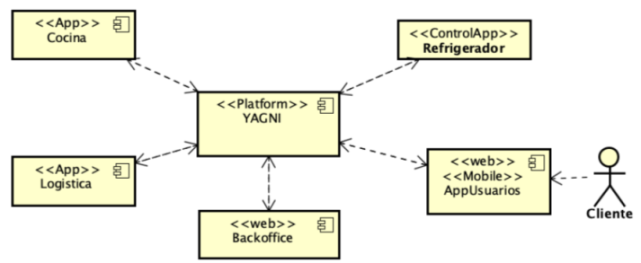

**Actores**: Usuario y Cliente.

**Dispositivos**: Refrigerador y Cocina.

**Roles**: Admin, Supervisor de Cocina, Supervisor de Local y Dispositivo.

A continuación se describen en alto nivel los **elementos del sistema**:

- **BackOffice**: Es la interfaz administrativa del sistema que permite a los administradores gestionar los distintos elementos del sistema. 

- **Aplicación Cliente**: Es la interfaz que utilizan los usuarios para interactuar con el sistema YAGNI. Permite a los clientes registrarse, realizar pedidos, seleccionar productos y programar retiros.

- **Cocinas**: Son las unidades responsables de la preparación de los productos. Están conectadas con el sistema para recibir pedidos y enviar notificaciones sobre el estado de la producción.

- **Logística**: Se encarga de la distribución de los productos desde las cocinas hasta los locales de retiro.

- **Locales**: Son los puntos de retiro donde los clientes pueden recoger sus pedidos.

- **Refrigeradores**: Son dispositivos en los locales que almacenan los productos preparados.

**YAGNI** adopta una **Arquitectura Híbrida** que combina:

- **Microservicios** para manejar funcionalidades específicas como cocina, logística, refrigeradores, y administración de usuarios.

- **Event-Driven Architecture** para la coordinación de eventos en tiempo real usando RabbitMQ, permitiendo que componentes como refrigeradores y dispositivos logísticos respondan de forma independiente y prioritaria a eventos críticos.

- **Service-Based Architecture** para funcionalidades internas que no requieren despliegue independiente pero se benefician de una modularidad clara, como la gestión de usuarios y perfiles.

### Vistas de Componentes y Conectores

**Tiers**

#### Representación Primaria

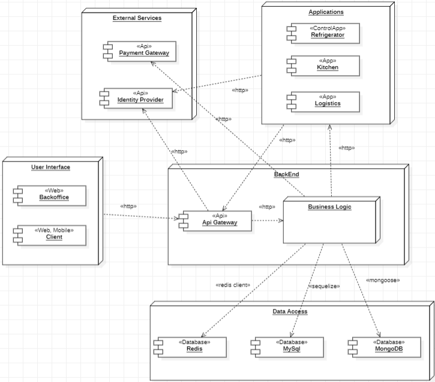

#### Catálogo de Elementos

Interfaz de Usuario

- BackOffice: aplicación web y móvil que permite que el personal administrativo de la empresa pueda definir precios de los productos del catálogo, registrar refrigeradores, locales, cocinas, y obtener información sobre ventas y stock;

- Client: interfaz orientada a los clientes finales, quienes realizan pedidos, realizan el seguimiento de sus órdenes y recogen productos en los puntos de retiro. 

Aplicaciones

- Refrigerator: sistema embebido en los refrigeradores inteligentes que permite la administración del inventario en cada punto de retiro. Estos dispositivos pueden actualizar el stock en tiempo real y gestionar la entrega de pedidos al cliente mediante claves de acceso.

- Kitchen: sistema utilizado en las cocinas para gestionar la producción de pedidos. La aplicación recibe y organiza las órdenes de preparación, notificando al sistema logístico cuando un lote de productos está listo para ser enviado.

- Logistics: aplicación que gestiona la distribución de productos desde las cocinas a los puntos de retiro. Coordina los envíos y realiza el seguimiento de los vehículos en tiempo real, asegurando que los pedidos lleguen en tiempo y forma.

BackEnd

- Api Gateway: punto de entrada para todas las solicitudes al sistema YAGNI. Administra los servicios del sistema, redirigiendo las solicitudes y aplicando reglas de autorización para cada ruta.

- Business Logic: capa que contiene la lógica de negocio de YAGNI. Aquí se encuentran las reglas y procesos que organizan el flujo de trabajo, como la validación de pedidos, asignación de tareas a las cocinas, control de stock, y generación de notificaciones para usuarios y personal administrativo, entre otros.

Servicios Externos

- Identity Provider: proveedor de identidad federada, como Auth0, que se utiliza para la autenticación y gestión de usuarios en el sistema YAGNI. Permite verificar la identidad de clientes y empleados sin almacenar credenciales directamente en el sistema, aumentando la seguridad.

- Payment Gateway: pasarela de pagos que permite procesar las transacciones de los clientes de manera segura. La integración asegura que las transacciones sean rápidas y que se gestione adecuadamente el cobro y verificación de los pagos antes de confirmar pedidos.

Acceso a Datos

- MySql: base de datos relacional que almacena los datos estructurados del sistema YAGNI.

- MongoDB: base de datos NoSQL que se utiliza para la parte de consulta en el patrón CQRS, permitiendo una rápida recuperación de los datos de pedidos, facilitando la escalabilidad y optimización de las lecturas.

- Redis: almacenamiento en memoria que se utiliza como caché de datos y control de stock. 

#### Decisiones de Diseño

- BackOffice: prioriza la gestión centralizada de ABMs.

- Client: facilita pedidos y seguimiento de usuarios.

- Refrigerator: gestiona stock y entrega segura, optimizando la precisión en inventario.

- Kitchen: organiza la producción y envía notificaciones logísticas, mejorando la eficiencia.

- Logistics: coordina el envío y seguimiento de productos, asegurando entregas precisas.

- Api Gateway: centraliza accesos y protege servicios con autenticación del backoffice y autorización externa, impulsando la seguridad y escalabilidad.

- Business Logic: organiza la lógica de negocio, asegurando mantenibilidad y consistencia.

- Identity Provider: externaliza autenticación y roles, mejorando la seguridad.

- Payment Gateway: gestiona transacciones de forma segura, aumentando confianza y seguridad.

- MySQL: maneja datos estructurados con consistencia.

- MongoDB: optimiza consultas con velocidad.

- Redis: actúa como caché, impulsando la disponibilidad y eficiencia.

**Servicio**

#### Representación Primaria

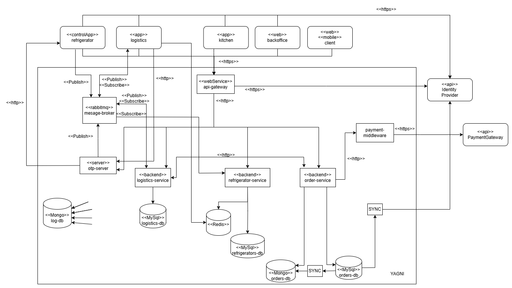

#### Catálogo de Elementos

Nos centraremos en los siguientes elementos: 

- Kitchen App
- Refrigerator App
- Logistics App
- Identity Provider

YAGNI

- Api Gateway
- Refrigerator Service
- Order Service
- Logistics Service
- Otp Server
- Message Broker
- Payment Middleware
- Bases de Datos
    - MySql
    - MongoDB
    - Redis

Recordamos que las aplicaciones `BackOffice` y `Client` serán simuladas completamente. Esto quiere decir que se ejecutará al levantar el sistema, el alta de todos los elementos iniciales que forman parte de YAGNI, incluidos los usuarios y clientes, y por otro lado que no contarán con servidor web ni con consola.

Cabe recalcar que la aplicación Client, al ser simulada completamente, el cliente tendra que visualizar consolas de servicios internos de YAGNI que en realidad en un sistema implementado no tendría el acceso.

Por otro lado, la implementación del Payment Gateway no se encuentra en los requerimientos.


R1 - backoffice -> idp (auth0)

R2 - backoffice -> mysql orders-db

R3 - backoffice -> mysql logistics-db

R4 - backoffice -> mysql logistics-db

R5 - backoffice -> mysql logistics-db

R6 - backoffice -> mysql refrigerators-db 

R7 - backoffice -> gateway -> refrigerator-service -> redis

R8 - backoffice -> gateway -> order-service -> mongo orders-db

R9 - backoffice -> gateway -> logistics-service -> mysql logistics-db

R10 - backoffice -> gateway -> order-service -> mongo orders-db

R11 - kitchen app -> gateway -> logistics-service

R12 - kitchen app -> gateway -> logistics-service

R15 - client app -> idp (auth0)

R16 - client app -> gateway -> order-service -> payment-middleware -> mysql orders-db

R17.1 - client app -> gateway -> refrigerator-service

R17.2 - client app -> gateway -> order-service

R17.3 - client app -> gateway -> order-service

#### Decisiones de Diseño

A continuación se mostraran las decisiones que en este documento anteriormente no se comentaron:

La integración de un proveedor de identidad externo (como Auth0) en YAGNI centraliza la autenticación y administración de usuarios, simplificando el control de roles y permisos.

La conexión con una pasarela de pagos confiable asegura la protección de las transacciones financieras. Esto es esencial para ofrecer una experiencia de pago segura y confiable.

Además, la implementación de un intermediario permite validar y procesar transacciones antes de su envío al gateway de pago, sumado a la facilidad para implementar cambios o añadir características de pago sin alterar el flujo principal de la plataforma.

Por otro lado, el agente de mensajes permite la comunicación asincrónica entre los servicios de YAGNI, optimizando la escalabilidad y robustez del sistema. Por ende, se opera de manera independiente, lo cual mejora la resistencia a fallos y reduce la latencia en la comunicación interna.

Por último y relacionado a lo anterior, se tiene un servidor Https que genera las OTP dentro del sistema YAGNI, lo que garantiza la seguridad en la generación de OTP al usar cifrado en tránsito (TLS). Las claves a través del agente de mensajes para que puedan ser consumidas por el servicio de los refrigeradores junto a la aplicación, desacoplando la generación de su consumo y permitiendo escalabilidad.

#### Rabbit Broker: 

queues:

- OTP

    - servicio: *userDriver-refrigerator_key*       
        - otp server -> product id, product quantity, key -> refrigerator service   

    - servicio: *userClient-refrigerator_key*                 
        - otp server -> product id, product quantity, key -> refrigerator service 

    - servicio: *refrigerator_app-refrigerator_key*           
        - refrigerator app -> key -> refrigerator service         

- OS (order status)

    - servicio: *kitchen-batch_status*       
        - logistics service -> ready_batch -> logistics app

    - servicio: *premise-batch_status*       
        - logistics app -> in_premise_batch -> logistics service

    - servicio: *travel-batch_status*        
        - logistics app -> in_transit -> logistics service

    - servicio: *refrigerator-order_status*  
        - logistics app -> in_refrigerator -> logistics service

    - servicio: *orderId-order*             
        - logistics app -> order id -> logistics service

    - servicio: *productBoxes-order*        
        - logistics service -> product boxes -> logistics app

publicadores:
- otpserver OTP
- logisticsservice OS
- refrigeratorapp OTP
- logisticsapp OS

suscriptores:
- refrigeratorservice OTP
- logisticsservice OS
- logisticsapp OS

Con respecto a la sincronización entre las bases de datos de las ordenes y productos, no se implemento con rabbit, sino que fue realizada a través de la emisión de eventos, con el recurso `event emmiter`.
                        
**Procesos**

<ins>1. Diagrama de Máquina de Estado</ins>

#### Representación Primaria

Caso de uso: flujo de trabajo de un pedido por parte de un cliente.

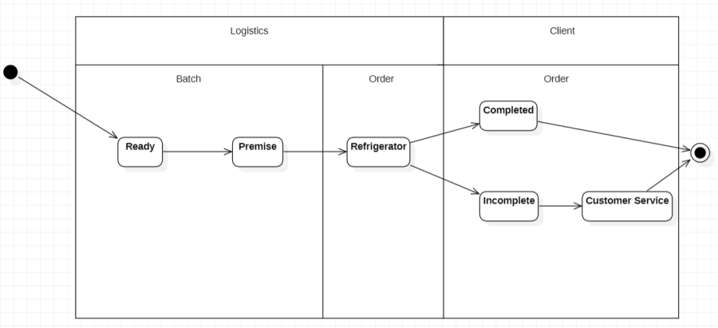

#### Catálogo de Elementos

Estados en el ciclo de vida de un lote

- (En la cocina)
- Listo para retirar de la cocina
- (En camino al local)
- Local

Estados en el ciclo de vida de un pedido

- En el refrigerador
- Pedido completado con éxito
- Pedido no completo
    - En atención al cliente

#### Decisiones de Diseño

Dividir el ciclo de vida de un pedido en etapas bien definidas permite gestionar cada estado como un módulo independiente, simplificando tanto la implementación como el mantenimiento del sistema. Este enfoque modular facilita además el rastreo de problemas en cada fase del proceso y permite una resolución rápida y específica.

Este control permite que el sistema de pedidos responda automáticamente según el estado actual del pedido o parte del pedido, mejorando la experiencia del cliente y optimizando la cadena logística.

<ins>2. Diagrama de Comunicación</ins>

#### Representación Primaria

Caso de uso: un cliente retira su pedido de un solo refrigerador con éxito.

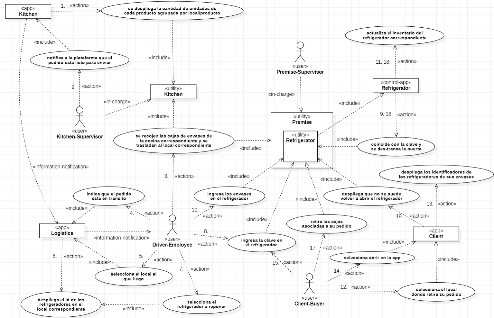

#### Catálogo de Elementos

Aplicaciones

- Usuarios con rol Dispositivo:
    - Cocina
    - Refrigerador
- Logística
- Cliente

Actores

- Cliente
- Empleados YAGNI
    - Conductor
    - Supervisores
        - Cocina
        - Local

Utilidades

- Cocina: representa el lugar físico donde se encuentra la cocina, junto al escaner.
- Refrigerador: representa el refrigerador, teclado, trancas y demás (hardware).
- Local: representa el local donde se reciben los pedidos, que cuenta con los refrigeradores.

#### Decisiones de Diseño

Se recreó esta vista con el propósito de exponer y describir con mayor claridad el flujo de comunicación entre la cocina y el local, junto a los factores y elementos relacionados.

Para esto, el diagrama describe los siguientes requerimientos:

- Visualización de productos a preparar
- Notificación de listo para envío 
- Notificación de producto para transporte
- Reposición de stock en el local de retiro
- Retiro de pedido

### Vistas de Módulos

**Uso**

<ins>1. Diagrama de uso del sistema por los usuarios</ins>

#### Representación Primaria

Comunicación de usuarios a través de aplicaciones, vía web y mobile.

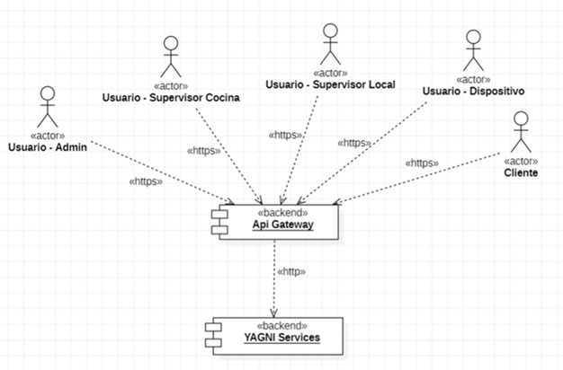

#### Catálogo de Elementos

- Usuario Administrador del Sistema: tiene acceso a todas las funcionalidades.

- Usuario Supervisor de Cocinas: tiene acceso a las funcionalidades de las cocinas.

- Usuario Supervisor de Locales: tiene acceso a las funcionalidades del refrigerador.

- Usuario Dispositivo: expone las funcionalidades de las cocinas y refrigeradores como dispositivos.

- Usuario Cliente: el cliente se comunica con el sistema a través de la interfaz de usuario mobile/web.

- Api Gateway: actúa como punto de entrada al web service, utilizando el proveedor externo de identidades.

- Servicios de YAGNI: exponen la lógica de la aplicación, relacionandose con las bases de datos y servicios externos correspondientes.

#### Decisiones de Diseño

En el caso del Api Gateway, la decisión primaria se basa en proteger los servicios internos de accesos no autorizados, por lo que se asegura un enrutamiento adecuado de las solicitudes y se utiliza un proovedor externo para la autenticación y autorización.

Por otro lado, la elección de los microservicios se tomó a favor del cumplimiento de la disponibilidad, escalabilidad, y mantenibilidad del sistema.

<ins>2. Diagrama de dependencias entre paquetes</ins>

#### Representación Primaria

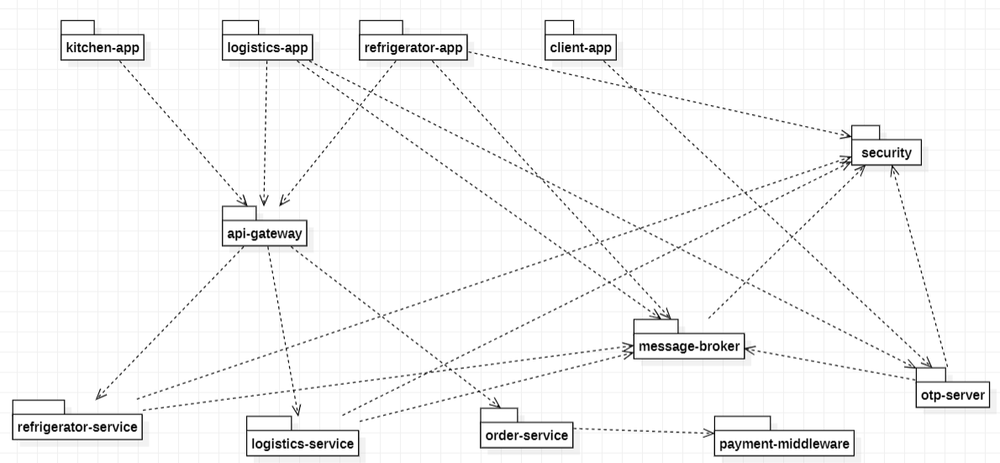

**Modelo de datos**

#### Representación Primaria

MER genérico de YAGNI

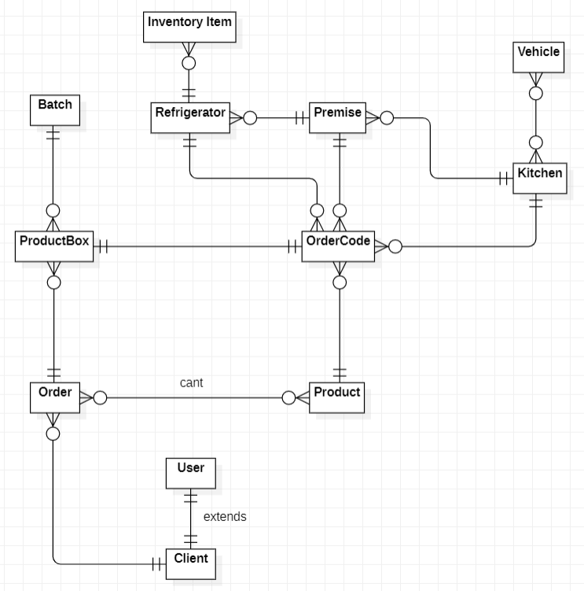

#### Catálogo de Elementos

- Lote de cajas
- Caja de Producto
- Código de caja
- Pedido
- Producto
- Camioneta
- Inventario de Refrigerador
- Refrigerador
- Cocina
- Local
- Usuario
- Usuario Cliente 

#### Decisiones de Diseño

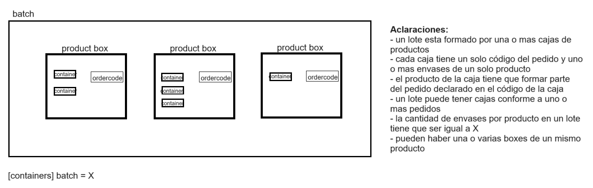

### Vistas de Asignación

**Despliegue**

La siguiente vista se compone de más de un diagrama.

#### Representación Primaria

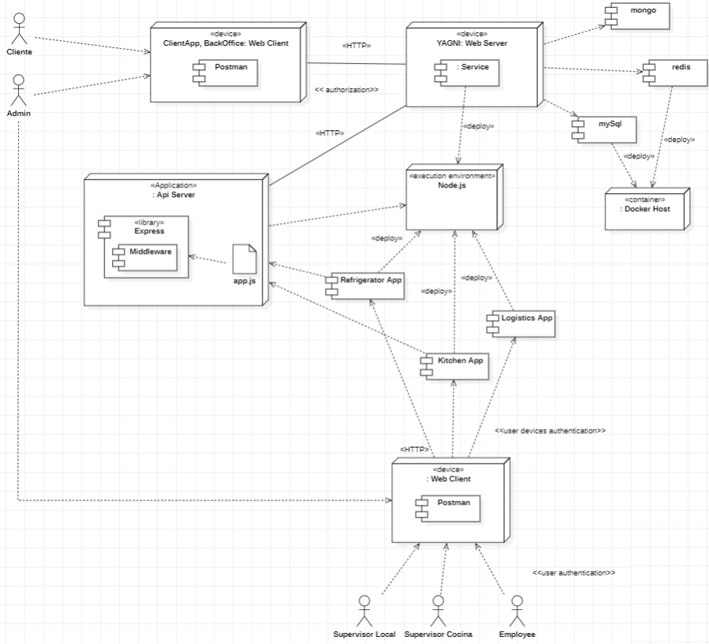

### Patrones de Diseño

**Publish-Subscribe**

El patrón Publish-Subscribe es fundamental en YAGNI para la coordinación eficiente de la logística. Este patrón permite desacoplar la comunicación entre los distintos componentes, como las cocinas, los vehículos de reparto y los locales de retiro. 

El objetivo es que las cocinas, al finalizar la preparación de un lote de productos, puedan notificar automáticamente a los sistemas de logística sobre los productos listos para envío sin necesidad de depender de una llamada directa o sincrónica entre servicios.

Es utilizado por el patrón CQRS.

**Gatekeeper**

El patrón Gatekeeper se basa en introducir un servicio intermediario o fachada que actúa como un punto de control antes de acceder a servicios de YAGNI. En el proyecto, la API Gateway cumple el rol de Gatekeeper.

Nos permite la protección de datos sensibles, la minimización de Riesgos de Ataques MitM, el filtrado de solicitudes y capacidad de registro. 

Asociamos la OTP a tokens temporales que expiren dentro de un periodo corto de tiempo.

**Microservicios**

Segmenta la funcionalidad en servicios independientes, asegurando la autonomía de cada componente. Los microservicios se comunicarían entre sí utilizando API RESTful y estrategias de comunicación como mensajería basada en eventos.

Se permite el despliegue y escalabilidad independientes, disponibilidad como la tolerancia a fallos y comunicación para optimizar el rendimiento del sistema. 

**Federated Identity**

El patrón de Identidad Federada se utiliza para manejar la autenticación de usuarios y clientes a través de un proveedor externo, como Auth0, evitando el almacenamiento de credenciales en el sistema interno.

Mejora la seguridad al delegar la autenticación a un proveedor externo especializado. Auth0 asegura la verificación de identidad y la administración de roles de usuarios sin almacenar contraseñas directamente en YAGNI.

**CQRS**

Se separan las escrituras y lecturas entre las bases de datos, evolucionando de manera independiente.

Las consultas intensivas de lectura se gestionan en MongoDB, aprovechando su velocidad para obtener datos rápidamente, como el estado de pedidos o stock. El uso de Redis ayuda a cumplir con los tiempos de respuesta y maneja las consultas disminuyendo la sobrecarga.
Por otro lado, las operaciones que modifican datos se realizan en MySQL, garantizando la consistencia e integridad de los datos.

La sincronización es realizada a través de emisiones de eventos de creación y actualización de pedidos y productos, en tiempo real.

**Circuit Breaker** 

El patrón Circuit Breaker se emplea en YAGNI para mejorar la disponibilidad y la tolerancia a fallos cuando se interactúa con servicios externos, como la pasarela de pagos.

### Tácticas de diseño

Seguridad

- **Audit**: a través de los logs, se hace posible la revisión del funcionamiento del sistema.

- **Authenticate Actors**: los actores que interactúan con el sistema (usuarios administrativos, supervisores y dispositivos) deben autenticarse a través de Auth0 para validar su identidad.

- **Authorize Actors**: cada actor autenticado tiene asignados permisos específicos basados en roles. Se gestiona la asignación y verificación de estos permisos, de modo que solo los actores autorizados puedan realizar ciertas acciones.

- **Limit Access**: el acceso a recursos específicos en YAGNI está restringido según el rol del usuario y sus necesidades. Por ende, los usuarios solo tienen acceso a endpoints específicos.

- **Separate Entities**: separamos los componentes del sistema para limitar el impacto de una posible brecha. Este es el caso de los servicios independientes, la Api Gateway como punto de entrada controlado y la segmentación de las bases de datos.

Disponibilidad

- **State Resynchronization**: el circuit breaker implementado en la solución cambia su estado cuando se realiza un evento de fallo, asegurando la consistencia del sistema.

- **Retry**: un caso claro es el reintento del circuit breaker sobre las operaciones de comunicación con la pasarela de pago después de un fallo. 

- **Exception Detection**: se identifican las excepciones que ocurren durante la ejecución del programa. Capturamos automáticamente los errores y excepciones en tiempo de ejecución, guardandolos para su futura revisión.

- **Timestamp**: registramos los eventos con tiempo para detectar anomalías y errores a través del sistema de logging implementado.

- **Reconfiguration**: el circuit breaker tiene la capacidad de reajustar ciertos parametros de configuración con respecto a los pagos, como el porcentaje transitorio y no transitorio de fallas, además de los reintentos.

Modificabilidad

- **Split Module**: se dividen los módulos grandes en módulos más pequeños, cada uno con una única responsabilidad clara. Esto facilita la comprensión y modificación de los módulos individuales. 

- **Redistribute Responsibilities**: la reasignación de las responsabilidades en todos los modulos del proyecto, a través de la descomposición en archivos como se mostró en el diagrama de descomposición, mejora la cohesión y reduce la complejidad del funcionamiento que aportan sus respectivas clases. Nos permite que cada una de ellas tenga un propósito más definido y menos sobrecargado de tareas, apuntando al principio SRP.

- **Couple-Time Parameterization, Interpret Parameters**: a través del uso de un archivo .env, el paquete dotenv y el método dotenv.config(), se definieron variables de entorno que afectan el comportamiento del sistema. Por ende se definieron parámetros al instanciar cada servicio que son interpretados en tiempo de inicialización, en lugar de en tiempo de compilación. Estos aplazan la vinculación, permitiendo mayor flexibilidad y facilidad de cambio. 

- **Abstract Common Services**: Algunos servicios comunes que encapsulan funcionalidades compartidas entre varios módulos son el logging, message broker y el certificado de seguridad para Https.

Interoperabilidad

- **Orchestrate**: se coordinan las interacciones entre las solicitudes y los servicios mediante la implementación de patrones como el gatekeeper, en este caso la Api Gateway como componente central de orquestación.

- **Use an Intermediary**: a tráves de la biblioteca Express introducimos middlewares que gestionan la comunicación entre los demás módulos. También ocurre especificamente con la Api Gateway, un claro ejemplo que utiliza la biblioteca Axios, encargándose de redireccionar las solicitudes a los distintos servicios según corresponda.

- **Manage Resources**: el sistema mantiene conexiones persistentes con los proveedores externos cuando es posible y utiliza estrategias de reconexión y manejo de fallos para asegurar que las solicitudes se procesen incluso si ocurren interrupciones temporales. 

Testeabilidad

- **Abstract Data Sources**: se utilizaron abstracciones para fuentes de datos, permitiendo la generación de datos falsos, gracias al uso de la biblioteca faker.

- **Localize State Storage**: los estados de los pedidos en YAGNI se guardan en las colas de Rabbit en tiempo real, facilitando el acceso rápido y con precisión de los mismos.

Performance

- **Bound Execution Times**: la inicialización del circuit breaker implementada da la opción de configuración de la propiedad de timeout, donde se establece el límite máximo para la ejecución de tareas sobre sistemas externos.

- **Prioritize Events**: el sistema permite asignar diferentes niveles de prioridad a eventos y procesarlos en consecuencia a partir del uso de RabbitMQ. Garantiza que los eventos de alta prioridad, como el desbloqueo de los refrigeradores se gestionen rápidamente, mejorando la eficiencia y la satisfacción del cliente.

### Tiempos de Respuesta

Recordamos:

- Modo normal: sistema trabajando en promedio con 3000 pedidos concurrentes por segundo.
- Modo sobrecargado: sistema trabajando en promedio con 8000 pedidos concurrentes por segundo.

**Funcionalidades**

- Listado de Reportes:
los tiempos promedios en desplegar los listados solicitados no deben superan los 500 ms con el sistema operando en modo normal y un segundo operando en modo sobrecargado.
  - Listado de existencias por producto
  - Listado de pedidos
  - Listado de producto por estado en tiempo real
  - Listado de pedidos por estados

- Notificación de producto para transporte:
el tiempo transcurrido entre la notificación de la cocina y la recepción por parte de la aplicación de logística no debe superar los 2 segundos con el sistema operando en modo normal.

- Reposición de stock en el local de retiro:
el tiempo entre que el conductor selecciona el refrigerador y recibe la clave enviada por YAGNI no debe superar a un segundo bajo cualquier condición de carga en el sistema.

- Compra de productos:
el tiempo máximo de respuesta entre que el usuario confirma el pedido y que YAGNI le responde no debe superar los 600 ms. con el sistema operando en modo normal y un segundo operando en modo sobrecargado.

- Respuesta de solicitudes de la pasarela de pago:
debe demorar, en forma aleatoria, en responder solicitudes de pagos en más de 3 segundos

**Hardware**

Las pruebas de carga y valores obtenidos de las funcionalidades anteriormente mencionadas, se ejecutaron con la siguiente especificación:

CPU: Intel Core i5-1035G1

RAM: 4 GB

Disco Duro: SSD 512 GB

Sistema Operativo: Windows 11 Home

## Stack Tecnológico

**Lenguajes**: JavaScript y TypeScript.

**Frameworks**: Node.js como entorno de trabajo, Express para la API junto con las aplicaciones web y mobile del lado del servidor y Jest para las pruebas unitarias.

**Librerías**: `typescript`-`ts-node` para compilar los archivos escritos en TypeScript y correr los archivos en JavaScript, `express` como aplicacion web de Node, `axios` para llamadas externas, `opposum` para el circuit breaker, `winston` para registro de logs, `artillery` para las pruebas de carga, `amqplib` como message broker, `redis` como cliente redis, `mysql2` como cliente mysql, `mongoose` como ODM de mongodb, `sequelize` como herramienta ORM / `sequelize-cli` como cliente sequelize, `events` para la sincronización entre mongo y mysql, `jsonwebtoken` para la seguridad en la transmisión de datos sensibles, `auth0` para el seed de usuarios en el idP, `node-forge` para cifrado tls, `Faker` para generar datos, `dotenv` para configuración en tiempo de inicialización y manejo de variables de entorno de manera más eficiente.

**Base de datos**: MySQL, MongoDB, Redis y Auth0 Database.

**Servicios Externos**: Axios para la comunicación con servicios externos.

**Seguridad**: JSON Web Tokens para asegurar la transmisión de credenciales, Auth0 para la emisión de los tokens, autenticación y gestión de los roles del sistema, y luego cifrado https para el envío seguro de OTPs.

**Simulaciones**: Uso de Postman y aplicaciones de consola.

## Configuración

**Cola asíncrona de mensajes**:

Descargar/Instalar RabbitMQ por páginas oficiales:

- `Erlang` 
- `RabbitMQServer`

Agregar los siguientes valores a la variable de ambiente de tu sistema llamada `Path`:
```
C:\Program Files\RabbitMQ Server\rabbitmq_server-4.0.3\sbin
C:\Program Files\Erlang OTP\bin
```

Comandos:

- `rabbitmqctl stop`
- `rabbitmq-server` 

Visualización web:

```
url: http://localhost:15673
user: guest
password: guest
```

**Logs**:

Se requiere descargar, instalar y correr un servidor de MongoDB de manera local. 
Para visualizar los logs de YAGNI, se puede utilizar la aplicación `MongoDB Compass`.

**Redis**:

No se debe modificar el archivo `redis.conf`.
Se requiere descargar, instalar `Docker Desktop` y ejecutarlo.

Luego utilizar una imágen de Redis a través de Docker: 

Para esto ya existe un archivo `docker-compose.yml`. Se debe abrir una terminal en la ubicación `redis/src/` y ejecutar los siguiente comandos:

```
docker-compose up -d
docker start redis_yagni-server
```

**Servicio de Pedidos de Productos y Reportes**:

Se requieren realizar los mismos pasos relacionados con Docker pero en este caso para MySQL. En este caso hay que abrir la ubicación `order-service/src/main-db/`.

```
docker-compose up -d
docker start mysql_orders
```

Luego se requiere conectarse a través de `MySQL Workbench`:

```
Host: localhost
Puerto: 3307
Usuario: root
Contraseña: password
```

**Servicio de Refrigeradores y Logística**:

En este caso, se previó la posibilidad de crear la base de datos de MySQL con las migraciones, sin necesidad de utilizar Docker, ni instalar MySQL Server.

**1**. Primero acordarse instalados los paquetes asociados a los clientes de MySQL y Sequelize, como el ORM de Sequelize Para Node.Js:

```
npm install mysql2
npm install sequelize
npm install sequelize-cli
```

**2**. Ubicarse en la carpetas `/src/` del servicio y realizar los siguiente comandos:

```
npx sequelize-cli db:create
npx sequelize-cli db:migrate
```

En el caso de tener instalado `sequelize-cli` de manera local:

```
npm install -g sequelize-cli
```

No es necesario utilizar `npx` antes de `sequelize-cli`, como se muestra anteriormente.

De esta manera creamos nuestra base de datos en MySQL y creamos las tablas correspondientes a los modelos.

**Protección contra ataques de tipo MitM - Https**:

Build de Certificados:

```
npm start: [/src/security, /src/message-broker]
npm start_rsa: [/src/otp-server, /src/refrigerator-app, /src/refrigerator-service]
```

Archivos:

```
- C/users/<user>/.npmrc:

registry=http://registry.npmjs.org/
strict-ssl=true
cafile=C:/Users/<user>/<download_folder>/-202746-241128-263824/src/security/ca-cert.pem
```

```
- C:/Users/<user>/AppData/Roaming/RabbitMQ/rabbitmq.config:

management.listener.port = 15673
management.listener.ip = 0.0.0.0
listeners.tcp.default = 5672
listeners.ssl.default = 5671
ssl_options.cacertfile = C:/Users/<user>/<download_folder>/-202746-241128-263824/src/security/ca-cert.pem
ssl_options.certfile = C:/Users/<user>/<download_folder>/-202746-241128-263824/src/message-broker/message-broker-server-cert.pem
ssl_options.keyfile = C:/Users/<user>/<download_folder>/-202746-241128-263824/src/message-broker/message-broker-server-key.pem
ssl_options.verify = verify_peer
ssl_options.fail_if_no_peer_cert = true
```

```
- C:/Users/<user>/AppData/Roaming/RabbitMQ:

[rabbitmq_management].
```

Condiciones:

```
C:/users/<user>/.erlang.cookie = C:/Users/<user>/AppData/Roaming/RabbitMQ/.erlang.cookie
```

**Conexión Auth0 como Identity Provider**

Se tiene la Api `Solid` tal que la audiencia es `https://api.solid.com` y las aplicaciones que interactúan con ella.

Cada Aplicación tienen su `client_id` y `client_secret`.

El inquilino de Auth0 lleva la `public key` y la url de dominio de Auth0 es conformada por: `<nombre_del_inquilino>.us.auth0.com`

Autenticación:

- metodo: POST
- url: ```https://dev-inmo2-0-ort.us.auth0.com/oauth/token```
- body: {

    "client_id": "<client_id>",

    "client_secret": "<client_secret>",

    "audience": ```"https://api.solid.com"```,
    
    "grant_type": "client_credentials"
    
    }

Autorización:

- metodo: GET
- url: ```https://dev-inmo2-0-ort.us.auth0.com/userinfo```
- authorization: "bearer <token>"

Definiciones:

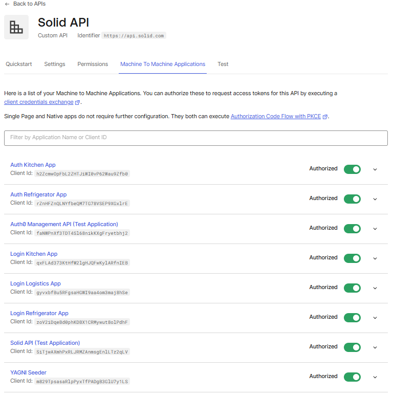

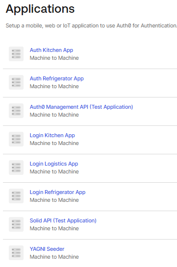


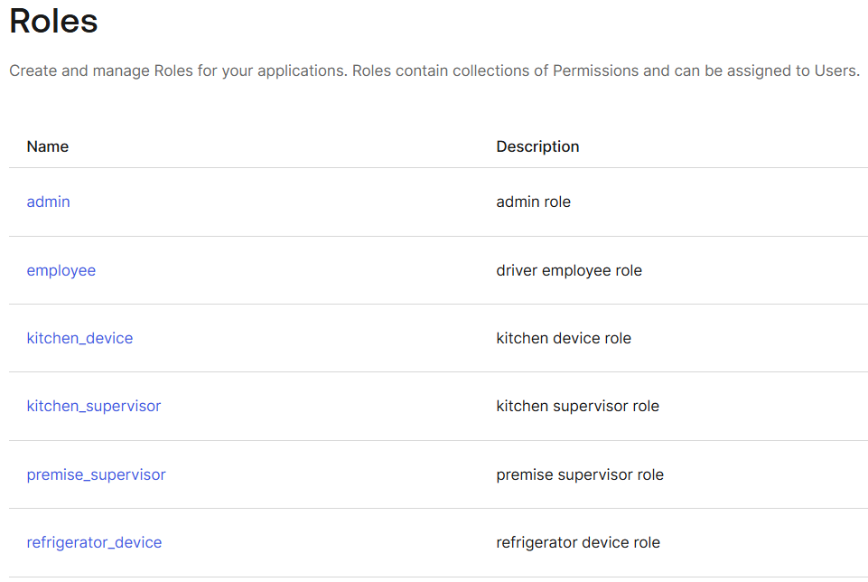

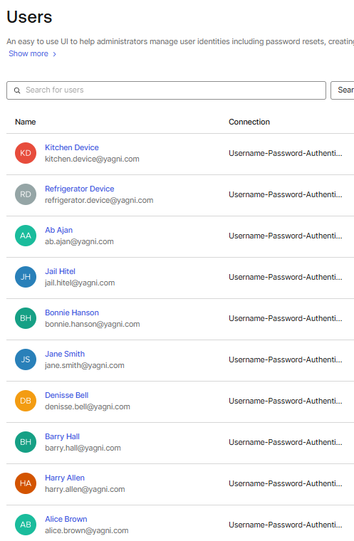

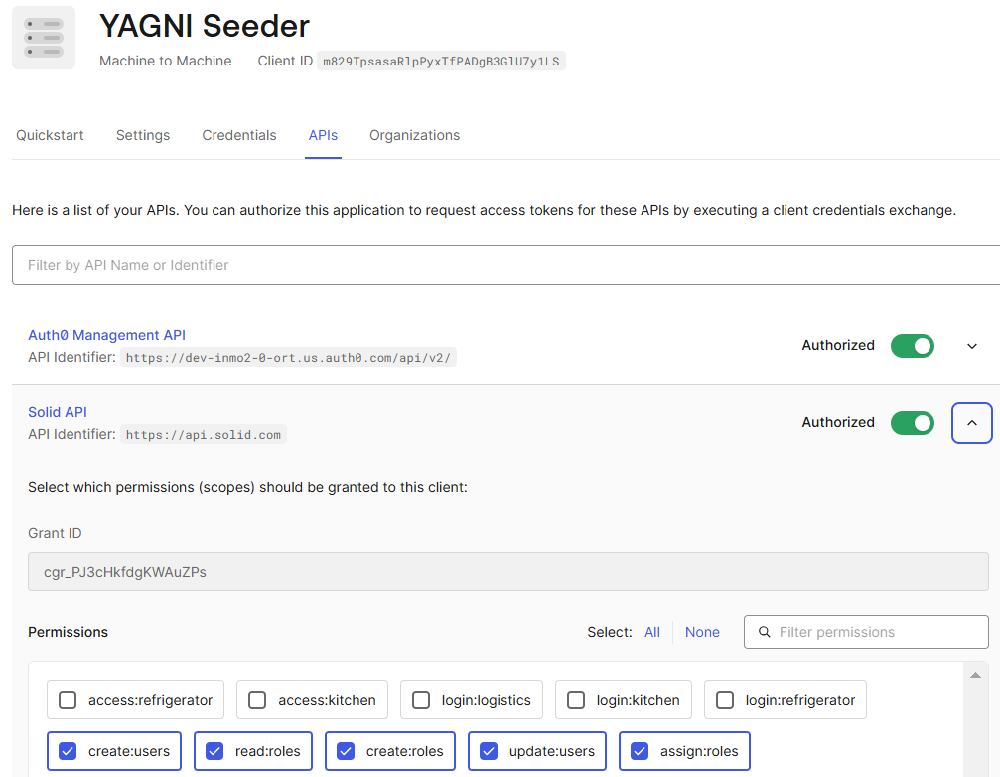

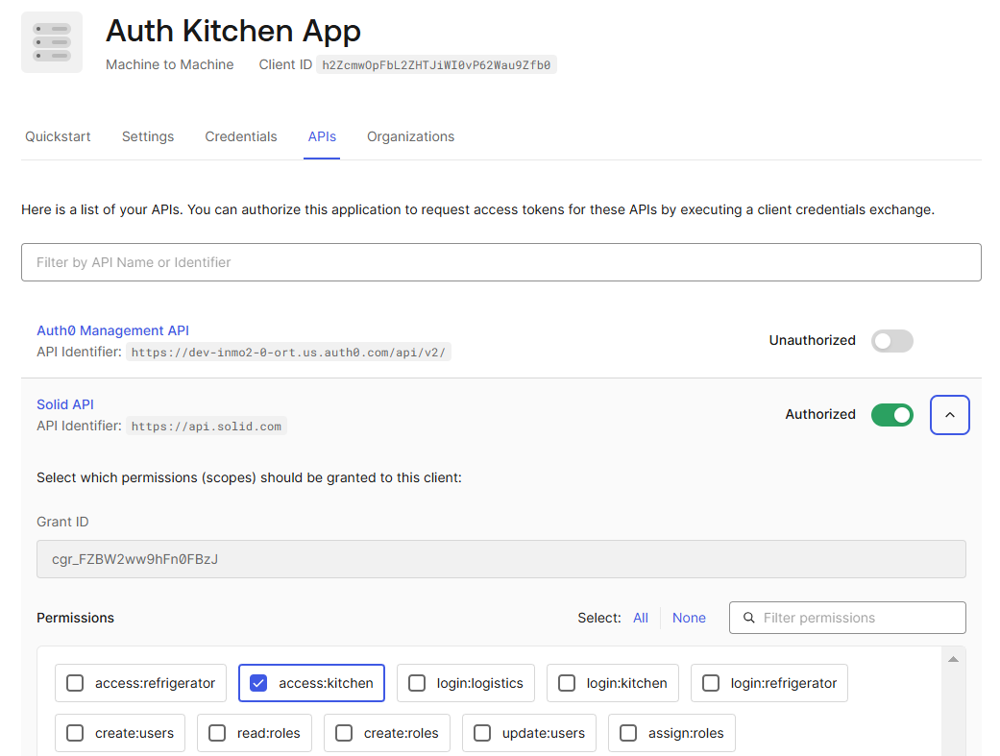

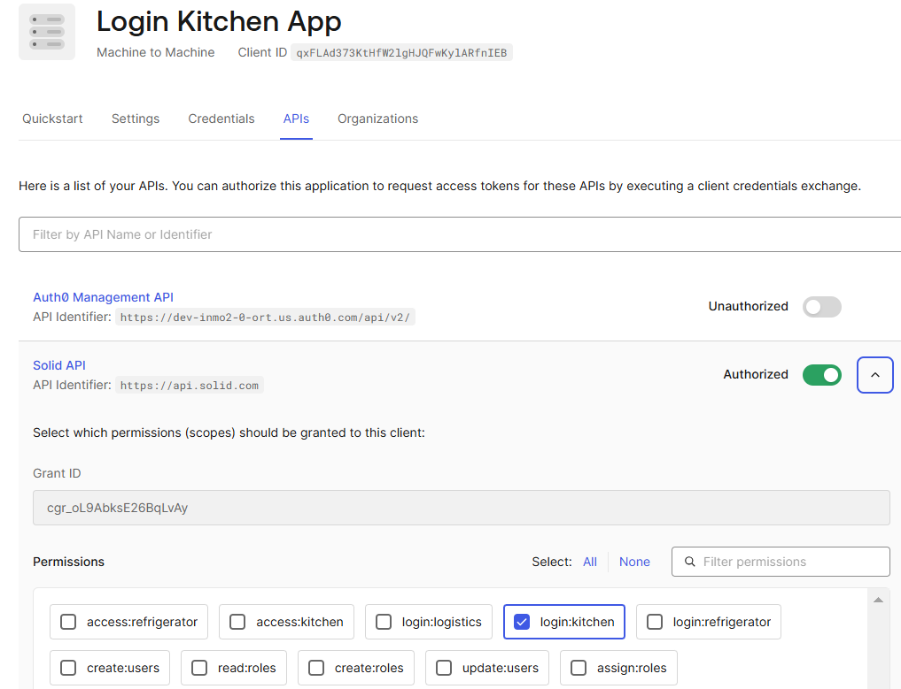


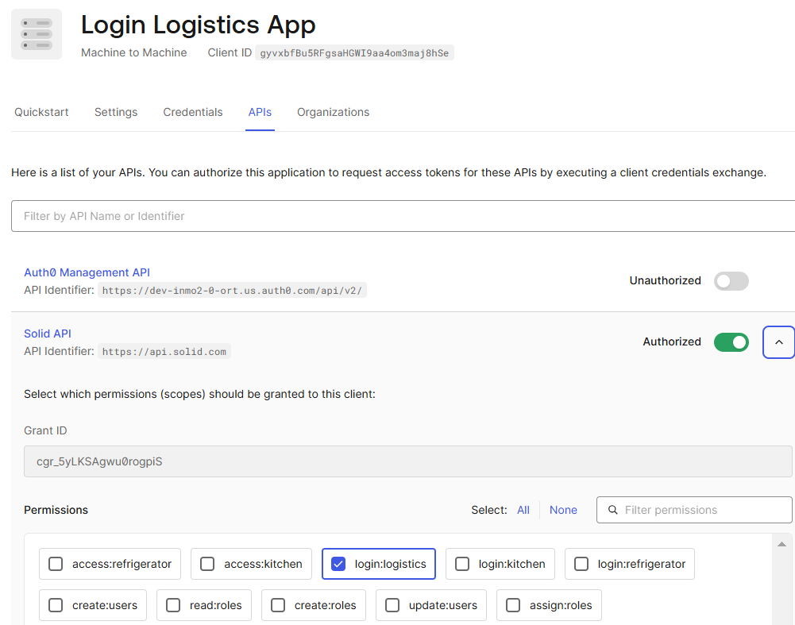

## Requerimientos No Implementados

- Implementación del historial de productos en los refrigeradores, para así poder visualizar los productos que contenían por el período seleccionado. La idea era realizarlo en Mongo.

- Notificar a cada cocina qué cantidad de cada producto preparar para que los locales de retiro cuenten con el stock mínimo necesario para que los clientes puedan retirar sin esperas (teniendo en cuenta el lapso de tiempo en horas H, que YAGNI se guarda para realizar y enviar el pedido al local). Parte de esta implementación se pensaba continuar con la interacción con Redis, donde ya se guarda el stock en tiempo real.

- Restringir el acceso a los refrigeradores cuando un cliente que ya retiró su pedido, intenta reabrir el refrigerador solicitando una nueva clave, una vez seleccionado que su pedido fue completado.

- Restringir y filtrar de manera acorde, la visualización del catálogo por parte del cliente sólo hasta 10 productos por consulta.

## Flujo de SOLID-YAGNI

1. *CLIENTE REALIZA SELECCION DE PRODUCTOS DE CATÁLOGO PARA EL PEDIDO*:
- admin/client --> CLIENTE OBTIENE CATALOGO DE PRODUCTOS: 
                ```http://localhost:3000/products``` 
               --> CLIENTE VISUALIZA sólo hasta 10 productos, y elije 2 unidades de 2 productos de los visualizados.

2. *CLIENTE REALIZA UN PEDIDO*:
- admin/client --> ```http://localhost:3000/orders```

      { 
        userId: ..,
        products: 
        [
	      {
		    productId: ..,
  		    quantity: ..
	      },
	      {
		    productId: ..,
  		    quantity: ..
	      }
        ],
        paymentMethod: ..,
        pickUpDate: ..,
        pickUp: ..
      }


3. *UN ENCARGADO DE COCINA PERMITE VISUALIZAR PRODUCTOS A PREPARAR*
-  admin/kitchen-supervisor --> ```http://localhost:4002/kitchen-app/products/:idCocina```

4. *UN ENCARGADO DE COCINA NOTIFICA QUE EL LOTE ESTA LISTO PARA ENVIAR*
-  admin/kitchen-supervisor --> ```http://localhost:4002/kitchen-app/batch```

        { 
			kitchenId: ..,
			batchId: ..,
			orderId:  ..,
			premiseId: ..
		}

5. *EL CONDUCTOR SIGUE TODO EL PROCEDIMIENTO DE LOGÍSTICA a través de la APLICACIÓN de LOGISTICA y posteriormente en la APLICACIÓN de REFRIGERADOR.
- admin/employee --> ```....```

6. *CLIENTE RETIRA PEDIDO*
     - admin/client --> CLIENTE PUEDE VISUALIZAR LA CONSOLA DE SERVICIO DE PEDIDOS
     - admin/client --> CLIENTE VISUALIZA TODOS LOS IDS DE LOS REFRIGERADORES DEL PEDIDO
   	            --> ```http://localhost:3011/refrigeratorsOrder/:idPedido```    
      	
        [repetir por refrigerador] 

	  	- admin/client --> CLIENTE SELECCIONA REFRIGERADOR EN LA APP	
	  	- admin/client --> CLIENTE NOTIFICA AL SERVIDOR DE OTP
	  	- admin/client --> ```http://localhost:443/send-otp```
        
              {
				 "product_quantity":.. ,
			     "product_id": .., 
                 "service": "userClient-refrigerator_key",
                 "refrigerator_id": ..
              }

	  	- admin/client --> CLIENTE OBSERVA LA CONSOLA DEL SERVIDOR DE OTP Y LA INGRESA EN LA APLICACIÓN DE REFRIGERADOR

7.  
    1. *CLIENTE MARCA PEDIDO COMO COMPLETO*
    - admin/client --> ```http://localhost:3000/orders/complete/:pedidoId```
	            --> CLIENTE PUEDE VISUALIZAR LA CONSOLA DE SERVICIO DE PEDIDOS

    2. *CLIENTE MARCA PEDIDO COMO INCOMPLETO* (el cliente no saca todos los productos del pedido)
    - admin/client --> ```http://localhost:3000/orders/incomplete/:pedidoId```
    
8. *REPORTES*

- admin --> DESPLIEGA LISTADO DE PRODUCTOS POR REFRIGERADOR
            ```http://localhost:3000/refrigerators/products/:id```
        
- admin --> DESPLIEGA LISTADO DE PEDIDOS POR PERÍODO (se muestra si fue completado con éxito o no)
            ```http://localhost:3000/orders/clients/:id```
        
- admin --> DESPLIEGA LISTADO DE PRODUCTO POR ESTADO EN TIEMPO REAL 
            ```http://localhost:3000/logistics/products/:id/state```


